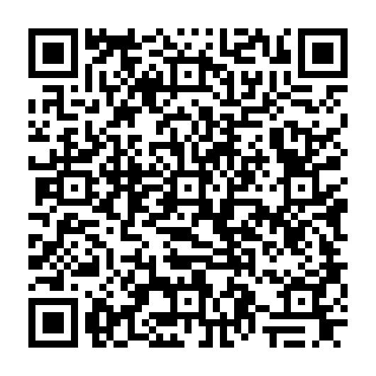
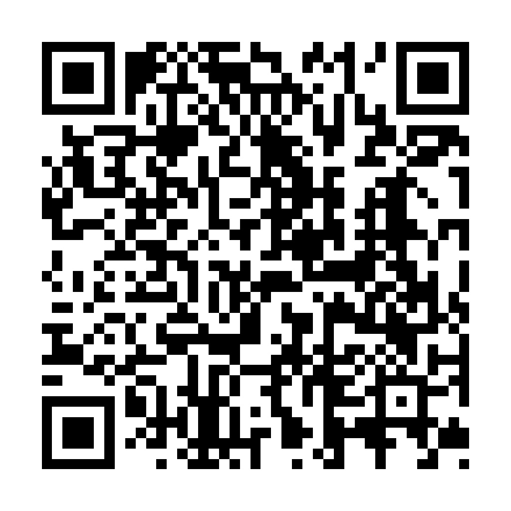

---
# Feel free to add content and custom Front Matter to this file.
# To modify the layout, see https://jekyllrb.com/docs/themes/#overriding-theme-defaults

layout: single 
title: Syllabus      
lang: us   
ref: syl   
permalink: /   
toc: true  
toc_label: "Syllabus Contents" 
toc_icon: "book-open"  
toc_sticky: true   
read_time: true  
show_date: true  
date_format: "%Y-%m-%d"  
date: 2025-12-30  
last_modified_at: 2025-12-30   

---

<!-- <mark>As of August 25, 2025, this site is under construction as we approach the start of our semester. Once the Syllabus and Schedule have been fully updated, this banner will disappear.</mark> -->

## 1. Essential Contact Information  

**Course Number:** MUS/DCS 256   
**CRN:** 10621/10650    
**Credits:** 1   
**Semester:** Winter/Spring 2026   
**Time:** Mondays and Wednesdays from 13:10—14:30     
**Location:** Bates Sound Studio (Olin 302)  
**Format:** Lecture/Demonstration    
**Modality:** In-person   
**Modes of Inquiry**: \[CP\] \[HS\]       
**Writing Credit**: None     
<!-- **GEC(s)**:      -->
<!-- <em><b>* hybrid and virtual available in extenuating circumstances at the discretion of the instructor</b></em>    -->

**Instructor:** Prof. Dr. Louis Goldford  
_You can call me Louis_.   

**Email:** <a href="mailto:lgoldford@bates.edu">lgoldford@bates.edu</a>  
**Office Hours:** Wednedsays from 11:00—12:30 or by appointment*.    
**Office Location:** Olin 260   
_*To schedule office hours by appointment, email me with some possible times on upcoming days._   

**Studio Assistant:** Tamrin Ghai  
**Email:** <a href="mailto:tghai@bates.edu">tghai@bates.edu</a>  
<!-- **Studio Hours:** Tuesdays and Thursdays from 14:30—16:30       -->
**Studio Hours:** TBA    

**Course Website:** [https://einbahnstrasse.github.io{{ site.baseurl }}/](https://einbahnstrasse.github.io{{ site.baseurl }}/){:target="_blank"}  

_Our course website, and especially its [Schedule page]({{ site.baseurl }}/schedule/){:target="_blank"}, will be used to distribute course materials while all grading and assignment submissions will take place through Lyceum and Etna. You will need to consult this site before each class to keep up with our daily materials, changes to our schedule, etc. If you're viewing this Syllabus on a projected screen, bookmark our site at the following link:_   

<!--     -->

    
## 2. Course Description    

<!-- This course focuses on the creative acts of recording and sound design. Technical topics covered include recording (both studio and experimental techniques), microphone placement, editing and mixing in REAPER (an open source software), effects and digital processing, and sound design for stereo and multitrack speaker arrays. Creative assignments improve listening skills, foreground aural experience, increase awareness of sonic environments, and sharpen skills related to the use of sound as a sensory and communication medium. Listening and reading assignments support creative and technical concepts covered. Students generate three to four new, original sound-based works during the course of the semester, one of which is refined for a final public listening session. Recommended background: interest in or experience with music or music software, sound, or digital media.   -->

Designed as a sound synthesis course with an emphasis on MaxMSP software and its libraries, this course focuses on building immersive auditory scenes through creative coding, computer-assisted composition (CAO), sound spatialization, and physical modeling synthesis. Students will develop practical and artistic skills in designing spatial audio systems, shaping psychoacoustic effects, and constructing interactive environments that place listeners inside a sonic field. Immersion here is understood as the creative shaping of auditory perception through technology and composition. Projects emphasize hands-on experimentation with architectural and spatial models of sound, resulting in small works that may take the form of original musical scores with electronics, improvisational environments, sonic installations, or virtual reality (VR) experiences. Public presentations of student works and classes will be held in the IM Studio multimedia space as well as the Bates Sound Studio. Recommended background: familiarity with computers, file systems, audio tools, or MaxMSP is helpful, though not required.

<!-- **Soundscapes: Recording and Designing Sound** is a first-semester foundational course in electronic music and sound art, introducing students to the studio environment and to the rudiments of recording, mixing, post production, synthesis and MIDI, computer music, and spatial audio. This semester will focus on **multichannel fixed media composition**. Prerequisites: Students should be comfortable with basic computer literacy (e.g., file management, navigation, saving and exporting files, connecting USB devices and external hard drives).   

Class sessions are structured with an emphasis on creating, transforming, and sculpting sounds. Classes will frequently consist of software tutorials and in-class demonstrations that can quickly be integrated into personal artistic projects. Students will be required to complete a number of smaller graded assignments, culminating in a final piece. Each week focuses on a new topic that builds upon work completed in the previous week. _**Students are therefore expected to attend regularly.**_ There are itermediary assignments and a **midterm exam**: a 3-minute stereo fixed media "sketch." This sketch can be expanded upon and made into the **final multichannel work**: a 6-8-minute multichannel work for a concert held on December 2nd. **Students are required to attend and present their work on December 2, 2025 from 7:30—9:30 PM**, with possible sound checks earlier in the day. A **final written exam** on digital audio fundamentals will be given during our final class period: on **Friday, December 5, 2025 at 2:40 PM**, before finals week.         -->

### 2.1 Course Goals      

Students will learn to **integrate** basic methods of computer music into a foundational MaxMSP workflow by **building fundamental control structures** such as loops and functions in addition to **contstructing** basic synthesizer elements. Various data clases, as well as historic approaches to classic synthesis and computer music paradigms by twentieth and twenty-first century composers, will be **observed** and **understood**. 
  
### 2.2 Learning Outcomes  

_By the end of the course, students will be able to:_  

1. **implement** and **demonstrate** the tools of computer music and synthesis within an artistic workflow  
2. **classify** and **identify** a variety of synthesis methods      
3. **design** compositional algorithms and **apply** them to the control of synthesizers  
4. **identify**, **critique**, and **experiment** with differing approaches to sound synthesis  
5. **compare** and **contrast** real-time and offline computer-assisted methodologies   
6. **assemble** favored tools into a personal creative coding practice, including a logical debugging process  
7. **submit** and **version** assignments through _GitHub_  

### 2.3 Course Materials        

_See the [RESOURCES TAB]({{ site.baseurl }}/resources){:target="_blank"} for download and documentation links._  

Although no specific requirement exists for software or hardware computational tools, the following list includes some computational tools that are strongly recommended. Students who do not have access to some or all of these are encouraged to enroll and to make ample use of the Bates Sound Studio facilities and DMS lab computers, where our campus computers may be used to complete all assignments. 

1. personal laptop  
2. headphones    
3. notepad and writing utensils for in-class note-taking     
4. external hard drive _(or cloud storage to back up media files and assets)_  
5. Access to the MaxMSP software (premium software but available on campus computers for free) 
6. Google Chrome or web browser that will allow you to access our Course Website & materials   
7. Various Max libraries and boilers posted throughout the semester (distributed through our course webite), such as the bach library for computer-assisted composition. See our Resources page for links and instructions.   
8. Terminal (pre-packaged on macOS/Linux) or Terminal Emulator (download for Windows users)  
9. Git version control system   
10. a public account on _GitHub.com_  

#### 2.3.1 Access to MaxMSP + Lab Scheduling      

You are **not required** to install MaxMSP on a personal computer in order to complete coursework for this class. MaxMSP is available to you on all computers in the Bates Sound Studio and in [DMS Computer Lab](https://www.bates.edu/digital-media/){:target="_blank"}, and these resources are sufficient for completing all assigned work.    

Because MaxMSP assignments and project work will be completed on a regular, semi-daily basis throughout the semester, students who rely on campus computers are expected to plan their work time in advance and schedule lab access in accordance with their normal availability. Timely completion of assignments depends on proactive planning, regular use of available lab resources, and committing work to your GitHub account by the deadlines. While lab availability may vary at busy times, the combination of the Bates Sound Studio and the DMS Computer Lab provides multiple access points. For this reason, extensions cannot be granted on the basis of difficulty securing lab time. Planning ahead is considered _part of the assignment workflow_ for this course.    

Installing MaxMSP on a personal device is therefore a matter of convenience rather than necessity. Students who choose to do so may find it easier to work flexibly without reserving lab time or traveling to campus, but this choice is entirely optional.        

If you choose to have MaxMSP on your device, there is a monthly subscription of $12.99, and I think they are still offering a first month free trial. So, if you start a trial now, by April you would pay 3 months of subscription for the entire semester, which should amount to $38.97. 

You can find details at: [https://cycling74.com/shop/max](https://cycling74.com/shop/max){:target="_blank"}     

Using MaxMSP without a license disables all saving features, so you'd need your own license to have it working on your own computer.     

#### 2.3.2 Public GitHub Accounts           

All MaxMSP assignments and related coursework will be submitted via [GitHub.com.](https://github.com/){:target="_blank"} Each student is required to maintain a public GitHub account for the duration of the semester and to organize their work using a clear, consistent repository and folder structure; with files ("patches") organized clearly into weekly subdirectories (as demonstrated in class).  

At the start of the semester:
- Create a GitHub account (if you do not already have one)
- Share your GitHub username with the instructor (via the course's Intro Survey)
- Maintain public repositories so your course work can be graded without special permissions

Detailed setup instructions and a tutorial video will be provided in class.

#### 2.3.3 Course Format + Deadlines     

Demonstrations and instruction take place in class: Mondays and Wednesdays. Your task is to **rebuild the MaxMSP pedagogical "patches"** introduced during the week. **Actively take notes on paper** in class so that you can reconstruct these patches later in the labs, undersand how they function, and how to creatively change them. If you have a personal laptop with MaxMSP licensed, you are invited to begin this work alongside the in-class demonstrations. However, in class, use of a personal laptop is strictly limited to MaxMSP coursework only. You will be instructed to put your computer away if you are using your laptop for other purposes.  

Each week’s material is expected to be reconstructed independently throughout the week and ***must be fully completed, committed, and pushed to your GitHub account by 11:59 p.m. on Saturdays.***

Your GitHub repository at the time of grading serves as the official record of submission. Work that is not committed by the deadline is considered incomplete for grading purposes.   

#### 2.3.4 Grading Timing and Late Work Policy    

Grading for weekly assignments occurs on Sundays. Because of this workflow:     
- Work that is not committed by Saturday night at 11:59 p.m. will be considered late     
- Late submissions will be graded with deductions     
- Extensions may not be granted retroactively      

This policy ensures consistent evaluation across the class and reflects the professional expectation that work be ready for review at scheduled times.

#### 2.3.5 Late Submissions          

Late work will be assessed according to the following schedule:
- Submitted by Saturday, 11:59 p.m.: on time; no penalty
- Submitted on Sunday (after 11:59 p.m. Saturday): −10%
- Submitted on Monday: -20%
- Submitted on Tuesday: −30%
- Submitted on Wednesday: −40%
- Submitted on Thursday: −50%
- More than one week late: may receive no credit unless prior arrangements have been approved by the instructor. 

Submissions that are missing required files, are improperly organized, or cannot be located in your GitHub repository at the time of grading may be treated as late or incomplete.

### 2.4 Output + Assessment   

#### 2.4.1 Weighted Components    

_Your course grade will be determined by the following weights:_   

- Assignemnts: 20%  
- Attendance + Participation: 10%    
- 3-Minute Stereo Sketch (Midterm): 15%   
- Final Work or Demonstration (Final*): 40%    
- Final Exam: 15%    

_*Your Final Work or Demonstration score will also include your attendance and participation at our final concert on **Tuesday, April 14, 2026, at 7:30 PM**._ 

See [6. General Grading Rubric](#6-general-grading-rubric) below for a detailed summary of project work grading policies.    

## 3. Expectations   

### 3.1 General Expectations   

1. **Arrive on time** to all course sessions.  
2. Spend **additional hours outside of class each week** on the timely completion of our assignments and projects (see 3.2.1 below).  
3. Submit assignments by the given deadlines on Lyceum.   
4. **Back up and organize your work REGULARLY.** _Catastrophic loss of materials is not, unfortunately, an excuse for missed deadlines!_  

### 3.2 Weekly Preparation      

1. **Study video tutorials, slides, readings, and other assigned materials ahead of class.** Come prepared with clarifying questions.  
2. We will devote the majority of our class time to demonstrating and creating, and therefore **we will be unable to present videos, slides, and readings in class.** Familiarize yourself with this background content beforehand so that you are not lost. Most likely, we will not reference at least some of these materials directly during our class session.   
3. Additionally, it is strongly encouraged that you **consult the recommended software documentation resources**. These provide context and will deepen your understanding as you build your own systems and creative tools.  

#### 3.2.1 Workload Expectations   

At Bates College, 1 course credit is equivalent to approximately 180 hours of total academic work over a semester. This includes both class time and independent work. Since this course meets for 4 hours each week, students should expect to spend an average of **8–11 additional hours** on a combination of assigned and project work, readings, listening, and other assignments or preparation each week. This guideline ensures the course meets federal and college standards while supporting your progress through consistent engagement inside and outside of class.

### 3.3 Communication   

1. Weekly class sessions will be held in the Bates Sound Studio. Questions can easily be addressed during, as well as before and after, our class, over email and during office hours.   
2. Bates email accounts are our official means of communication.  
3. **Requests for assistance:** Send an email to the instructor and studio assistant. I will respond during normal working hours; requests arriving "after hours" will be answered on subsequent weekdays.  
4. **Actively participate** in our class discussions. **Thoughtfully contribute to a positive classroom environment,** while supporting and challenging your colleagues’ ideas.  
   
### 3.4 Self-Guided Work  

1. All students are responsible for building each of our pedagogical Max patches **by themselves**.    
2. Rebuilding pedagogical patches fosters a habit of **personal practice** in Max and **promotes self-guided learning** and **understanding** of each patch's raw components.  
3. Students are also responsbile for producing their **own work** throughout the class, including their own builds of our pedagogical patches, in accordance with our [Academic Integrity Policy](#academic-integrity-policy) below.  
4. Students should rely on our **class discussions**, **patch comments**, **office hours**, Max's extensive **documentation**, **help files**, and **user forums** to actively troublehsoot and **debug** issues that are naturally expected to arise during patching/coding. _This is how one learns best as they engage in project work._   
5. By adopting this policy, we avoid fostering a habit of **relying on others' code**: that is, constantly borrowing Max patches from colleagues or forums without learning to understand its underlying functionality.  
6. This policy is **not to enforce copying or mimicking**, but rather to promote **reasoning through the pedagogical lessons** and adopting these patches **as templates and boiler documents**, that is, as a basis for future work, aimed at **building independence and creativity**. At its core, this policy, therefore, combats the habit of **copying code** without understanding its functioning.         
7. At first, students will **progress slowly**. However, just like learning to drive a car, students  become more efficient over time as they **build resourcefulness**. Through our class patches and projects, students **will learn to debug faster**, to actively seek solutions from the best resources for any given necessity, and to find resolution in an efficient, self-guided manner.   

### 3.5 Attendance + Participation Policy   

#### 3.5.1 The Band Model     

In the symphony orchestra, or in any band, each individual musician contributes something unique. And I mean something _very real_ here; not some vague sense of personal uniqueness: Often, each person carries a specific melodic strain written especially for them, or their part, perhaps one of many _melodic voices_ in a _contrapuntal fabric_. As you may know, the effect of good counterpoint combined with good playing creates something _miraculous_ — something that cannot be replicated by any of those melodies on their own. In the absence of the skills contributed by each person occupying a chair on stage, _a musical structure cannot remain intact_. The group suffers. Bandmates who have been playing together for several years sound better for a reason. You can even hear it.   

Unlike the orchestra, however, in class there is no “sub list” to fill your seat when you cannot be here. This semester, think of yourselves as members of the orchestra, the band, the collective, or the crew. “The show must go on” exists as an idiom because _nobody else can carry your part_ in the musical fabric. It means that you make your presence a priority, and that you _contribute to the group_ because you understand that your presence offers precisely what others cannot. Your presence has value that resists being quantified. It also means that your absence is _felt_ as a detriment to the community’s _progress_ from one rehearsal to the next. So avoid absences and lateness wherever possible for our collective benefit. In reality, musicians don’t show up for rehearsals _having prepared and practiced in advance_ simply because some teacher told them to. They elect to do this on their own, of their own volition, _because they know their value_.    

#### 3.5.2 Absences     

Success in this course depends on your consistent attendance and active engagement with our skills building goals. **Up to 2 excused absences are permitted. After these 2, additional absences will be treated as unexcused and will negatively impact your attendance and participation grade**. If you anticipate conflicts, it is my expectation that you will speak with me as soon as possible and early in the semester (i.e., by Week 3). **A lack of communication about planned absences will therefore be treated as unexcused**.   

**Absences and/or lateness must be accompanied by documentation and/or include advance notice**. These will not impact on your grade if they are reported in advance and are infrequent. Absences will be excused in cases of: documentation of illness provided by a doctor’s note and/or SSA, religious observance, official school-related activity, and on a case-by-case basis for other critical events, at the discretion of the instructor.

Note that **you are never required to disclose personal information to me**. Your SSA can serve as a liaison to communicate personal needs to me as well. Should there be significant campus changes regarding public health, all accommodations will be made to ensure your progress and wellbeing.   

In a skills-building music technology course such as this one, we must ensure that you are up-to-date on our materials each week — partly because the next week will often build on the materials covered last week.  

Missing _more than_ 2 class sessions will result in a grade reduction. Additional absences will further lower your grade and result in additionally assigned makeup work assigned by the instructor. In this scenario, the student completes all assignments, projects, and any additional material assigned by the instructor to help ensure understanding or evaluation of progress.  

#### 3.5.1 Prompt Arrival   

1. Students are expected to arrive promptly to all class sessions and remain until the end of the class period.  
2. On-time arrivals earn you an immediate 5 points (full participation).   
3. If you arrive after the start time, your participation points will be reduced according to the following scale:   

<table>
<colgroup>
<col width="30%" />
<col width="70%" />
</colgroup>
<thead>
<tr class="header">
<th>Arrival Time</th>
<th>Participation Points</th>
</tr>
</thead>
<tbody>
<tr>
<td markdown="span">14:40 or earlier</td>
<td markdown="span">5 points (full credit)</td>
</tr>
<tr>
<td markdown="span">14:41 – 14:50</td>
<td markdown="span">4 points</td>
</tr>
<tr>
<td markdown="span">14:51 – 15:10</td>
<td markdown="span">3 points</td>
</tr>
<tr>
<td markdown="span">15:11 – 15:25</td>
<td markdown="span">2 points</td>
</tr>
<tr>
<td markdown="span">after 15:25</td>
<td markdown="span">1 point</td>
</tr>
<tr>
<td markdown="span">absent</td>
<td markdown="span">0 points</td>
</tr>
</tbody>
</table>

#### 3.5.2 Absences   

All absences must be communicated and documented to be considered _excused_. This course does **not** permit undocumented or uncommunicated absences.   

Students may have up to 2 excused absences over the semester, provided that those absences meet the criteria below and are properly communicated. These are not “free” or automatic absences, and they still require documentation or advance notice as outlined here.   

##### 3.5.2.1 What Counts as an Excused Absence    

An absence may be excused under the following conditions:
- Documented illness (e.g., doctor’s note or equivalent medical documentation)
- Religious observance
- Official school-related activities (with documentation and advance notice)
- Other serious or unavoidable circumstances, considered case by case at the instructor’s discretion

Planned absences should be reported to the instructor by our Week 3 class _(see our [Schedule]({{ site.baseurl }}/schedule/){:target="_blank"} page)._   

##### 3.5.2.2 Absences + Grade Impact    

Absences that are not communicated in advance and/or not documented will be treated as unexcused. Unexcused absences will lower your participation grade, even if you have not exceeded the two-absence threshold. The first 2 properly documented and excused absences will not negatively affect your participation grade.

Each unexcused absence will result in a deduction from your final participation grade. The first unexcused absence results in a 5% deduction. Each additional unexcused absence results in a 10% deduction.

Students are permitted up to 2 excused absences without impact on their participation grade. Additional excused absences beyond this threshold will result in a participation grade adjustment, or may require alternative work, at the discretion of the instructor. In cases of ongoing illness, emergency, or other significant circumstances, students are expected to contact the instructor as early as possible to discuss options, which may include: Supplemental or alternative assignments, Consultation with Student Affairs or Accessible Education services. Even when absences are excused, sustained non-attendance may make successful completion of the course difficult or impossible.   

##### 3.5.2.1 Procedure for Absences      

If you must be absent for any reason, regardless of whether that absence is excused or unexcused, follow this **Procedure for Absences:**   

  1. Check our [Schedule]({{ site.baseurl }}/schedule/){:target="_blank"} for assignments, videos, slides, readings, etc.   
  2. Contact a classmate for **notes** on what you missed _(in accordance with [3.5.2.2 Sharing Patch Screenshots (MaxMSP)](#3522-sharing-patch-screenshots-maxmsp) below)._   
  3. After these first 2 steps, contact the instructor with any additional questions.   

* **Absences/tardiness must be accompanied by documentation** and/or include advance notice with the instructor. Absences/tardiness will not impact on your grade if they are reported in advance and if they are infrequent. Absences will be excused in cases of: documentation of illness provided by a doctor's note, religious observance, official school-related activity (always with documentation and advanced notice), and on a case-by-case basis for other critical events, at the discretion of the instructor.  
* Planned absences should be reported to the instructor by our Week 3 class _(see our [Schedule]({{ site.baseurl }}/schedule/){:target="_blank"} page)._   
* _A lack of communication with the instructor about planned absences will therefore be treated as **unexcused**. Be in touch early._     
   
##### 3.5.2.2 Sharing Patch Screenshots (MaxMSP)   

1. In accordance with [3.4 Self-Guided Work](#34-self-guided-work) above, students should **never share their DAW sessions or Max patches** (i.e., Reaper files or `.maxpat` files) with one another. 
2. Rather, students should **only share screenshots** of their work. In other words, all students should build each of the pedagogical models by themselves.   
3. See [How to take a screenshot on a Mac or PC](https://reviewed.usatoday.com/laptops/features/how-to-take-a-screenshot-on-mac-and-pc){:target="_blank"} for further details.   

#### 3.5.3 Particpation      

It is assumed that students are adults; fully capable of meaningful engagement in a shared intellectual space. The following rubric is not intended to police behavior or treat students as children, but rather to clarify expectations that are foundational to college-level learning. These expectations are articulated here explicitly, particularly with respect to attentiveness and engagement with shared materials, supporting a focused, respectful, and productive classroom culture, and to ensure that participation is assessed transparently and fairly.

<table>
<colgroup>
<col width="20%" />
<col width="80%" />
</colgroup>
<thead>
<tr class="header">
<th>Participation Grade</th>
<th>Description</th>
</tr>
</thead>
<tbody>
<tr>
<td markdown="span">A (Excellent)</td>
<td markdown="span">
Fully attentive throughout class; consistently engaged with discussions, group work, lecture materials, and projected media; demonstrates clear preparation; contributes thoughtfully and constructively without prompting; helps sustain a focused and collaborative classroom environment.
</td>
</tr>

<tr>
<td markdown="span">B (Good)</td>
<td markdown="span">
Generally attentive and engaged; participates regularly in discussions and group activities; prepared for class; demonstrates respect for shared materials and classmates; maintains focus without prompting. Fundamentally shows knowledge of reading materials and work outside of class.  
</td>
</tr>

<tr>
<td markdown="span">C (Adequate)</td>
<td markdown="span">
Inconsistent attentiveness; participates primarily when called upon but does not volunteer; engagement with discussions or projected media is uneven; preparation may be incomplete; occasional off-task behaviors or reminders to refocus.
</td>
</tr>

<tr>
<td markdown="span">D (Minimal)</td>
<td markdown="span">
Frequently disengaged; limited participation in discussions; inattentive to videos or demonstrations; repeated off-task behaviors (e.g., fidgeting, playing with objects, unrelated work or distracting use of phones or computers); necessitates reminders to engage, disruptive presentation.  
</td>
</tr>

<tr>
<td markdown="span">F (Absent Participation)</td>
<td markdown="span">
Persistent disengagement; does not meaningfully participate in class activities or group work; consistently inattentive to shared materials; interference with learning environment for self or others.
</td>
</tr>
</tbody>
</table>

This rubric exists to clarify what productive engagement looks like in a professional environment such as ours. It assumes that we are all capable adults who listen attentively and communicate directly in a collective setting. Your participation score is less about _speaking often_ and more about being _genuinely present:_ responding thoughtfully, supporting peers’ contributions, and posing questions in ways that keep the class moving forward. When these expectations are explicit, they are not constraints but a common framework that allows discussion, experimentation, and learning to function well for everyone in our studio community.    

## 4. General Schedule of Topics   

### 4.1 Disclaimer About Possible Changes   

_Please note: Our schedule of topics and their precise order may change._  

This syllabus is intended to give the student guidance in what may be covered during the semester. However, the instructor may modify, supplement, and make changes as course needs arise, especially in response to class pacing, technical needs, and other issues. 

_See the [SCHEDULE page]({{ site.baseurl }}/schedule/){:target="_blank"} for a precise weekly breakdown of topics and tasks. Changes will be updated there._  

_For a detailed list of assignments, points, and deadlines, see the [GRADING page.]({{ site.baseurl }}/grading/){:target="_blank"}_  

### 4.2 Weekly Topics     

<table>
<colgroup>
<col width="5%" />
<col width="15%" />
<col width="80%" />
</colgroup>
<thead>
<tr class="header">
<th>Week</th>
<th>Date</th>
<th>Topic(s)</th>
</tr>
</thead>
<tbody>
<tr>
<td markdown="span">1</td>
<td markdown="span">{{ site.week-01 }}</td>
<td markdown="span"><a href="{{ site.baseurl }}/schedule/#w1" target="_blank">{{ site.week-01-topic }}</a></td>
</tr>
<tr>
<td markdown="span">2</td>
<td markdown="span">{{ site.week-02 }}</td>
<td markdown="span"><a href="{{ site.baseurl }}/schedule/#w2" target="_blank">{{ site.week-02-topic }}</a></td>
</tr>
<tr>
<td markdown="span">3</td>
<td markdown="span">{{ site.week-03 }}</td>
<td markdown="span"><a href="{{ site.baseurl }}/schedule/#w3" target="_blank">{{ site.week-03-topic }}</a></td>
</tr>
<tr>
<td markdown="span">4</td>
<td markdown="span">{{ site.week-04 }}</td>
<td markdown="span"><a href="{{ site.baseurl }}/schedule/#w4" target="_blank">{{ site.week-04-topic }}</a></td>
</tr>
<tr>
<td markdown="span">5</td>
<td markdown="span">{{ site.week-05 }}</td>
<td markdown="span"><a href="{{ site.baseurl }}/schedule/#w5" target="_blank">{{ site.week-05-topic }}</a></td>
</tr>
<tr>
<td markdown="span">6</td>
<td markdown="span">{{ site.week-06 }}</td>
<td markdown="span"><a href="{{ site.baseurl }}/schedule/#w6" target="_blank">{{ site.week-06-topic }}</a></td>
</tr>
<tr>
<td markdown="span">7</td>
<td markdown="span">{{ site.week-07 }}</td>
<td markdown="span"><a href="{{ site.baseurl }}/schedule/#w7" target="_blank">{{ site.week-07-topic }}</a></td>
</tr>
<tr>
<td markdown="span">8</td>
<td markdown="span">{{ site.week-08 }}</td>
<td markdown="span"><a href="{{ site.baseurl }}/schedule/#w8" target="_blank">{{ site.week-08-topic }}</a>
</td>
</tr>
<tr>
<td markdown="span">9</td>
<td markdown="span">{{ site.week-09 }}</td>
<td markdown="span"><a href="{{ site.baseurl }}/schedule/#w9" target="_blank">{{ site.week-09-topic }}</a></td>
</tr>
<tr>
<td markdown="span">10</td>
<td markdown="span">{{ site.week-10 }}</td>
<td markdown="span"><a href="{{ site.baseurl }}/schedule/#w10" target="_blank">{{ site.week-10-topic }}</a></td>
</tr>
<tr>
<td markdown="span">11</td>
<td markdown="span">{{ site.week-11 }}</td>
<td markdown="span"><a href="{{ site.baseurl }}/schedule/#w11" target="_blank">{{ site.week-11-topic }}</a></td>
</tr>
<tr>
<td markdown="span">12</td>
<td markdown="span">{{ site.week-12 }}</td>
<td markdown="span"><a href="{{ site.baseurl }}/schedule/#w12" target="_blank">{{ site.week-12-topic }}</a></td>
</tr>
<tr>
<td markdown="span">13</td>
<td markdown="span">{{ site.week-13 }}</td>
<td markdown="span"><a href="{{ site.baseurl }}/schedule/#w13" target="_blank">{{ site.week-13-topic }}</a></td>
</tr>
</tbody>
</table>

   
## 5. Academic Integrity Policy    

### 5.1 General Notes on Academic Integrity   

Students and all others who work with information, ideas, texts, images, music, inventions, code, and other intellectual property owe their audience and sources accuracy and honesty in using, crediting, and citing sources. As a community of intellectual and professional workers, the university recognizes its responsibility for providing instruction in information literacy and academic integrity, offering models of good practice, and responding vigilantly and appropriately to infractions of academic integrity. Accordingly, academic dishonesty is prohibited at Bates College and is punishable by penalties, including failing grades, suspension, and expulsion. 

#### 5.1.1 Bates Statement on Academic Integrity    

Bates College is an academic community deeply engaged in inquiry and intellectual exchange and committed to core principles of academic freedom, academic integrity, and rigorous, creative thought. We recognize that intellectual and artistic exchange depend on a mutual respect for independent inquiry, reflection, and expression. Faculty, staff, and students alike are therefore dedicated to fostering an environment that upholds the highest standards of fairness, integrity, and respect in all their academic endeavors.

As contributors to an ongoing scholarly and creative conversation that depends upon thoughtful and fair acknowledgment and treatment of the inquiries, reflections, and expressions of others, each member of the Bates community is expected to use and represent the work of others fairly and honestly; to acknowledge the work of others fully and accurately through proper attribution and citation; and to produce their own work unless collaboration is allowed. Faculty and staff members are expected to meet these standards in all their work as described in the employee and faculty handbooks; students are subject to the policies and procedures described below.

In educating students in the values, dispositions, and responsibilities of independent thinkers and scholars, the Bates faculty recognizes that certain scholarly practices reflect complex tasks that require instruction and practice. Faculty are committed to teaching these critical practices. Students in turn are responsible for learning these scholarly practices and demonstrating them in all their work; they are not only a means of showing learning but of developing genuine understanding, not only the mark of an independent scholar but the way to become one.

This policy statement outlines these principles and practices, roles and responsibilities.

_Read more on Bates College Academic Integrity policies and procedures at the [Student Conduct & Community Standards website](https://www.bates.edu/student-conduct-community-standards/student-conduct/academic-integrity-policy/){:target="_blank"}._ 
   
#### 5.1.2 Use of Borrowed Code       
    
Code borrowed from another source must be attributed as a comment within your own code. If you are unsure of whether or not your work may constitute plagiarism, please check with the instructor before submitting. Where applicable and where marked within our course materials, follow the provisions of the [Creative Commons Attribution-ShareAlike 4.0 International License.](https://creativecommons.org/licenses/by-sa/4.0/){:target="_blank"}    

### 5.2 Intellectual Property   

Materials in this course are the intellectual property of their creators. They are presented to you for the purpose of learning, engaging with your peers, completing assignments, etc. Each of us must respect the rights of others by only using course materials for their intended purposes associated with this course. For instance, you are not permitted to share, upload, stream, sell, republish, share the login information for, or otherwise disseminate any of the course materials, such as: video and audio files, assignment prompts, slides, notes, syllabus, simulations, datasets, discussion threads, code, audio files, mixing sessions, etc. Conversely, any materials created solely by you (for example, your videos, essays, images, audio files, annotations, notes) are your intellectual property and you may use them as you wish.   

#### 5.2.1 Lectures and Recordings    

In line with our Student Code of Conduct, the Dean of Faculty Office reminds all students that screen capturing or making audio/video recordings of synchronous or asynchronous meetings, lectures, discussions, course materials, or other classroom activities without the prior knowledge and consent of all parties is strictly prohibited. This applies to the use of tape or digital recorders, cell phones, smartphones, computers, and other devices capable of creating a screen capture or making audio/video recordings. Likewise, the editing, sharing, or use of recorded or digitally shared course content outside of their assigned or intended purpose is likewise prohibited. Students with disabilities who wish to record classroom activity must contact the Office of Accessible Education for information about appropriate protocols.  

### 5.3 Generative AI Policy      

Generative AI tools (i.e., such as large language models, or LLMs, like ChatGPT and others) may be used **only when (and how) specified for course work, and otherwise are not permitted**. We will rarely, if at all, be using these tools in the study, creation, ideation, and audiation of sound and music within the context of this course. In other words, **unless otherwise noted, use of generative AI tools is explicitly prohibited**.   

Use of generative AI tools, only where explicitly permitted by the instructor, may be included for a particular assignment or exercise, for a particular course module, or for inquiry into a particular type of AI tool. As with any other academic resource used to create student work, any contribution of generative AI tools must be clearly disclosed by the student and cited like any other resource. 

For any assignment in which generative AI tools were used (always and only in accordance with the policy specified for this course or a particular assignment), students must include, in addition to a traditional bibliography, a written page entitled “explanation of AI tool use” that contains a description of which tools were used (such as ChatGPT, DALL-E, etc.), how each tool was used, (such as in ideation, research, analysis, editing, debugging, etc.), the specific prompts entered into the model(s), how model outputs were evaluated, and whether and where model outputs were used in the work that was submitted.

Use Chicago style citations and footnotes. See the Chicago Manual of Style's [Citation, Documentation of Sources page](https://www.chicagomanualofstyle.org/qanda/data/faq/topics/Documentation/faq0422.html){:target="_blank"} for up-to-date formatting guidelines regarding the use of generative AI tools. 

*Failure to attribute material to its original source constitutes plagiarism. Use of generative AI tools where not explicity sanctioned by the instructor constitutes plagiarism*. Students should be aware that **generative AI tools often generate incorrect statements, generate fake sources, and/or do not attribute material to proper sources**. Students must acknowledge all instances in which generative AI tools were used in an assignment (such as in ideation, research, analysis, editing, debugging, etc.). All submitted work by a student must  be original work that includes properly attributed external sources. **Students are responsible for the entirety of their final submission. Any inaccuracies or other deficiencies cannot and will not be excused on the basis of originating from an AI tool**.  

_Adapted from the [AI Pedagogy Project](https://aipedagogy.org/){:target="_blank"}_.    

### 5.3 Academic Integrity Pledge   

_By enrolling in this course, you pledge to uphold the policy on Academic Integrity described below:_  

I understand the value of personal integrity and ethical behavior in all aspects of my professional and personal life. By committing to honesty and personal responsibility, I earn the respect and trust of others. As a student at Bates College, I recognize that the value of my education is not just being able to say I am a college graduate, but it also incorporates the skills, values, and knowledge I have acquired. I thus commit myself to upholding academic integrity as an important aspect of my personal integrity and professional growth. I understand that academic integrity includes:  

1. Fully observing the rules governing exams and assignments regarding resource material, electronic aids, copying, collaborating with others, or engaging in any other behavior that subverts the purpose of the exam or assignment, and the directions of the instructor.   
2. Only turning in work that I have done myself, and not using unattributed work done by others. While working and studying with others can be an effective way to learn, submitted work will be my own.  
3. Giving full and proper credit to sources and references, and acknowledging the contributions and ideas of others, in my academic work.  
   
## 6. General Grading Rubric   

<table>
<colgroup>
<col width="20%" />
<col width="8%" />
<col width="75%" />
</colgroup>
<thead>
<tr class="header">
<th>Score</th>
<th>Grade</th>
<th>Description</th>
</tr>
</thead>
<tbody>
<tr>
<td markdown="span">93-100%</td>
<td markdown="span">A</td>
<td markdown="span">**Outstanding:** pushing the limits of both the student’s creativity and the assignment.</td>
</tr>
<tr>
<td markdown="span">90-92.9%</td>
<td markdown="span">A-</td>
<td markdown="span">**Impressive​:** demonstrates maximum aptitude and/or organizational skills.</td>
</tr>
<tr>
<td markdown="span">87-89.9%</td>
<td markdown="span">B+</td>
<td markdown="span">**High Achieving:** thoughtful and creative approach to the assignment.</td>
</tr>
<tr>
<td markdown="span">83-86.9%</td>
<td markdown="span">B</td>
<td markdown="span">**Thorough:** clear articulation of skills, concepts, and preparation.</td>
</tr>
<tr>
<td markdown="span">80-82.9%</td>
<td markdown="span">B-</td>
<td markdown="span">**Above Average:** quality work, but lacking in some problem-solving areas.</td>
</tr>
<tr>
<td markdown="span">77-79.9%</td>
<td markdown="span">C+</td>
<td markdown="span">**Well Intentioned:** submitted on time, completed according to minimum requirements.</td>
</tr>
<tr>
<td markdown="span">70-76.9%</td>
<td markdown="span">C</td>
<td markdown="span">**Average:** may need help with certain concepts and/or organization of ideas.</td>
</tr>
<tr>
<td markdown="span">60-69.9%</td>
<td markdown="span">D</td>
<td markdown="span">**Poor:** does not meet the minimum requirements.</td>
</tr>
<tr>
<td markdown="span">< 60%</td>
<td markdown="span">F</td>
<td markdown="span">**Fail:** not turned in, excessively late, or incomplete.</td>
</tr>
</tbody>
</table>

  

_For a detailed list of assignments, points, and deadlines, see the [GRADING TAB.]({{ site.baseurl }}/grading/){:target="_blank"}_  

### 6.1 Creative Exploration and Freedom    

Electronic music has always thrived outside the rigid confines of pre-determined stylistic, genre, and aesthetic classifications. Popular and Classical idioms represent just a _small fraction of possible approaches_ to the abstract and limitless potential of carefully crafted and _designed sound_. In this course, _strive to avoid letting any such idioms dominate your project work_. While you are welcome and encouraged to draw inspiration from these traditions, our focus is not on faithfully reproducing any of them — whether that means adhering strictly to pop song forms or using a synthesizer to “imitate” an orchestra or a sonata. The history of this music teaches us that it has always been a site of experimentation, invention, and reimagining, often pioneered by those who saw and heard the world differently — especially those from marginalized backgrounds.    

The expectation here is twofold: first, that you **engage with the new practices and techniques we study**, and second, that you **challenge yourself to produce work you might not be allowed (or inclined) to make in other settings**. The truth is there are very few opportunities in life to be rewarded for this level of aesthetic risk-taking. Think of this class as a laboratory where you are free to step outside familiar frameworks and create something you’ve never attempted before. Your projects should demonstrate openness and an experimental and free spirit when it comes to creating and shaping sound material — whether that means creating your first granular etude, your first experiences with multichannel sound, or even just using a sampler in an unconventional way. Despite that we study works and artists in this class who are known for their reinforcement of certain aesthetic norms, it should be understood that a remix project of the type described in _A Remix Manifesto_, for example, would be inappropriate as a final statement in this class. But then so would a project that treats a synthesizer (which can do anything we want if we design it carefully) as an acoustic instrument producing the highly predictable pure tones and typical patterns of an acoustic instrument.    

As you develop material for your project, feel free to check in with me about the direction you're heading in, or any ideas that you feel strongly or weary about. A discussion and reflection can usually provide clarity in this area. You can even welcome feedback from your classmates as well, if you wish.     

### 6.2 Extra Credit Opportunities        

Students may earn **up to 20 points of extra credit** per concert by attending any of 2 selected concerts during the semester that are designated on the studio calendar. This season includes 2 eligible concerts (January 24 and February 28), featuring music by faculty composers and guest artists working with electronics, computers, and music-technology systems directly related to the tools and concepts studied in this course.

To receive extra credit, students must:
- **Attend the concert in full** and take notes during the performance.
- **Submit a written reflection paper** (minimum: 4-5 pages) that thoughtfully connects what they heard and observed to specific course concepts, techniques, or analytical frameworks.   
- Address how compositional strategies, technological tools, or listening perspectives from class are **reflected in the work(s) presented**.   
- **Pose questions or curiosities** related to the concert that may not be answered by course content.  

Reflection papers must be **submitted within 3 days of the concert** to receive credit. Extra credit is intended to support deeper engagement with contemporary musical practice and to encourage students to connect theoretical study with live artistic work in professional performance contexts.

## 7. Student Services    

### 7.1 IT Service Desk     

The [IT Service Desk](https://bates.teamdynamix.com/TDClient/75/Portal/Home/?from=/helpdesk/){:target="_blank"} is the central location for all technology-related questions. If you are looking for an answer to a problem, check out their knowledge base. Here you will find answers to common questions or you can request assistance.

### 7.2 Course Accommodations and Accessibility           

It is my goal to create a learning experience that is as accessible as possible. If you anticipate any issues related to our course format, materials, or the requirements of this course, please meet with me during my office hours so we can explore potential options. Students with disabilities may also wish to work with the Office of Accessible Education to discuss a range of options to remove any barriers to learning, including official accommodations. Visit their website for contact and additional information: [https://www.bates.edu/accessible-education/](https://www.bates.edu/accessible-education/){:target="_blank"}. If you have already been approved for accommodations through the Office of Accessible Education, please meet with me so we can develop an implementation plan together. 

### 7.3 Student Academic Support Center (SASC)   
   
[The Student Academic Support Center (SASC)](https://www.bates.edu/student-academic-support-center/){:target="_blank"} provides peer-led support for introductory and intermediate level courses in a variety of fields. SASC also provides a variety of workshops in quantitative skills, time management, note-taking, and study skills. SASC partners with the Student Writing & Language Center to provide public speaking and presentation support (PSPS). SASC is located in the Peer Learning Commons (PLC) on the Ground Floor of Ladd Library. Students are invited to stop by, without an appointment, to the drop-in hours in Ladd to meet with a tutor, study independently, meet up with classmates, or to discuss learning strategies. Students who wish to set up an individual appointment can discuss options with a Resource Representative at the PLC check-in desk. For more information go to [www.bates.edu/sasc](www.bates.edu/sasc){:target="_blank"}. Or, email <a href="mailto:sasc@bates.edu">sasc@bates.edu</a> to ask additional questions.   

### 7.4 Counseling & Psychological Services (CAPS)   

Available to all Bates students, CAPS provides comprehensive, confidential mental health care. Services provided include assessment and evaluation, counseling, and referrals to off-campus providers for specialized or intensive treatment. Students can schedule an appointment by calling or visiting the office. More information can be found at [Counseling & Psychological Services (CAPS)](https://www.bates.edu/counseling-psychological-services/){:target="_blank"}.   

### 7.5 Health Services    

Operating in conjunction with Central Maine Medical Center (CMMC), Health Services is a place where students requiring care but not hospitalization may be seen for medical concerns. Services provided include general medical care, onsite pharmacy services, and diagnostic testing. Students can schedule an appointment by calling or visiting the office (31 Campus Ave), which is open Monday through Friday from 9am to 5pm. More information can be found at [Health Services](https://www.bates.edu/health-services/){:target="_blank"}.   

### 7.6 Office of Student Well-Being  

[The Office of Student Well-Being](https://www.bates.edu/well-being/){:target="_blank"} hosts a list of resources for students to support themselves across nine dimensions of well-being. In addition, there are regular programs open to all students, with a goal of helping students define what well-being means for them, and take action and ownership of their well-being journey.

### 7.7 Multifaith Chaplaincy

The [Multifaith Chaplaincy](https://www.bates.edu/multifaith/){:target="_blank"} warmly and creatively serves the religious, spiritual, searching, and seeking community at Bates. In addition to weekly and annual offerings, students can access confidential pastoral care and conversation by scheduling an appointment with a Multifaith Chaplain.

### 7.8 Student Center for Belonging and Community (SCBC)  

The [SCBC](https://www.bates.edu/student-center-belonging-community/){:target="_blank"} is a multipurpose space that welcomes those who value or embody diversity and aspire to participate in an inclusive community. Students come to the SCBC to seek support from professional staff and build community among those with similar identities and experiences. Cultural affinity groups often gather and provide peer to peer programming and community. In addition, Bobcat First! serves as a resource for students who identify as first generation to college.
    
## 8. Inclusivity    

### 8.1 Name and Pronoun Usage   

This course consists of individual work and group discussion. We must therefore strive to create an atmosphere of inclusion and mutual respect: all students will have their chosen gender pronoun(s) and chosen name recognized. If the class roster does not align with your name, gender, and/or pronouns, please inform the instructor.  

### 8.2 Inclusivity Statement    

_It is my intent that students from all diverse backgrounds and perspectives be well-served by this course, that students’ learning needs be addressed both in and out of class, and that the diversity that the students bring to this class be viewed as an asset and a resource. It is my intent to present materials and activities that are respectful of diversity: gender identity, sexuality, disability, age, socioeconomic status, ethnicity, race, nationality, religion, and culture. Your reflections on this topic are encouraged and appreciated. Feel free to reach out to me at any time about any issues concerning you._  

### 8.3 Principles of Community       

I am committed to providing an atmosphere for learning that respects diversity and supports inclusivity. We work together to build a community of learning. I ask all members of this class to:
- be open to and interested in the views of others
- consider the possibility that your views may change over the course of the term
- be aware that this course asks you to reconsider some “common sense” notions you may hold
- honor the unique life experiences of your colleagues and your own 
- appreciate the opportunity that we have to learn from each other
- listen to and draw from each other’s opinions, and communicate your positions in a respectful manner
- respect confidential discussions and personal boundaries  
- ground your comments in the music and sound we are studying. Refer frequently to our materials and make them the focus of your questions, comments, and arguments. This is the single most effective way to ensure respectful discussion and to create a space where we are all learning together.
   
### 8.4 Difficult Conversations    
   
In our class interactions, we may encounter opportunities to explore challenging, high-stakes issues and increase our understanding of different perspectives. Our conversations may not always be easy — even just about music (weird as that sounds). Inevitably, we will sometimes  make mistakes in our speaking and listening. We will need patience, courage, imagination, or any number of qualities to engage our materials, our classmates, and our own ideas and experiences. We will always need respect for others. An important goal will be for us to increase facility with difficult conversations that arise inside issues of social justice, politics, economics, morality, religion, and other issues where reasonable people often hold diverse perspectives. (This can even be music and sound!) This effort will ultimately deepen our understanding and allow us to strengthen our community with folks from many backgrounds, experiences, and positions. 

_Protip: You can use any such 'difficult' encounters as opportunities to tune your awareness of others while still sharpening your own arguments, and improving comfort with occupying your own position within a wider discourse_.    
    
## 9. Studio Community Standards      

### 9.1 Access to the Bates Sound Studio       

Olin 302 (the Bates Sound Studio) is a community space made available to trained professionals and students using it regularly in pursuit of their sonic creations and a shared discourse about sound and experimentation. It is available to students (1) who are currently enrolled in a digital audio course, or (2) who have previously taken one of our courses upon project approval. Other students may not use the Bates Sound Studio except in carefully supervised situations, again where approved.   

Students may be granted access to 302 for the semester in which they are enrolled in order to complete daily assignments and project work assigned in one of our classes. In some cases, their access may be extended beyond a single semester, e.g., to complete a senior thesis project, upon approval from Dr. Goldford.  

### 9.2 Use of Studio Equipment     

Currently enrolled students may also be granted borrowing privileges in order to check out audio and digital media equipment needed for their assignments. If a piece of expensive gear has been loaned out, the student in posession of that gear assumes full responsibilty for it. Equipment will be loaned out only for a limited amount of time necessary to complete an assignment and is *expected to be returned in the same condition in which it was issued*. Equipment will be inspected and tested upon return to ensure that our community continues to have access to well-maintained gear. In some cases, equipment may be approved for exclusive use witnin the Bates Sound Studio and should never be removed. 

Exact sign-out procedures and terms will be designated by the instructor.  

#### 9.2.1 Alternative Studio Gear   

For non-enrolled students interested in working with digital media, and when our currently enrolled students need access to computers and recording devices beyond what is available in our studio, please note that the computers in the Pettigrew iMac Lab have several audio software programs installed on them. 

The [DMS Loaner Pool](https://batesdms.getconnect2.com/){:target="_blank"} has **Home Recording Kits** that students can check out to do their own recording, including portable field recorders and recording devices, as well as several USB microphones. Ladd Library also has a Composition Room. 

### 9.3 Studio Protocol    

In professional studio environments, a studio protocol is a set of community guidelines respected by all members to ensure an equitable, safe, clean, productive, and efficient working space for all users. [In the Bates Sound Studio we must all respect our **community protocol guidelines**, which you can find here, on our Studio page](https://einbahnstrasse.GitHub.io{{ site.baseurl }}/studio/#studio-protocol){:target="_blank"}.    

### 9.4 Revocation of Access  

Access to Bates Sound Studio faciities and its equpiment may be revoked at any time and without prior notice by the instructor. This may happen as a result of poorly maintained, damaged, or missing equipment, doors left unlocked, power left routinely on, equipment left unattended or not returned to its rightful place, the presence of visitors in the studio who are not part of our community, or in the case of other scenarios. As a reminder, students working in the studio are on an honors system and expected to maintain our space with the highest level of respect and regard for our art form and our community, especially when we are entrusting students with the care for our delicate equipment. 

Studio equipment returned in worse condition that when issued, or in which is it returned in non-functional condition, or equipment that has been lost, will be subject to close scrutiny and will result in revocation of borrowing privileges and studio access, with the possibity of additional reporting to the Music Department and [Office of 
Student Conduct and Community Standards](https://www.bates.edu/student-conduct-community-standards/){:target="_blank"}.  

## 10. Library Course Reserves   

A list of titles has been placed on hold in Ladd Library for you. These supplementary texts on topics reelvant to our course can be found on reserve. [_Find the list of course reserves here._]({{ site.baseurl }}/in-class/course-reserves/){:target="_blank"}.